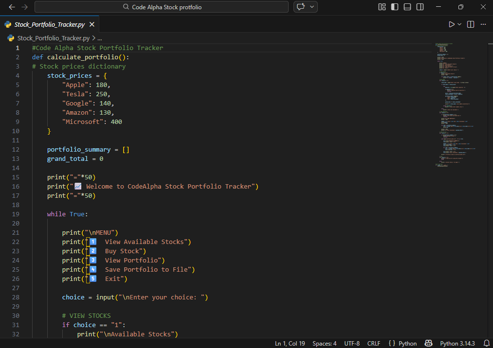
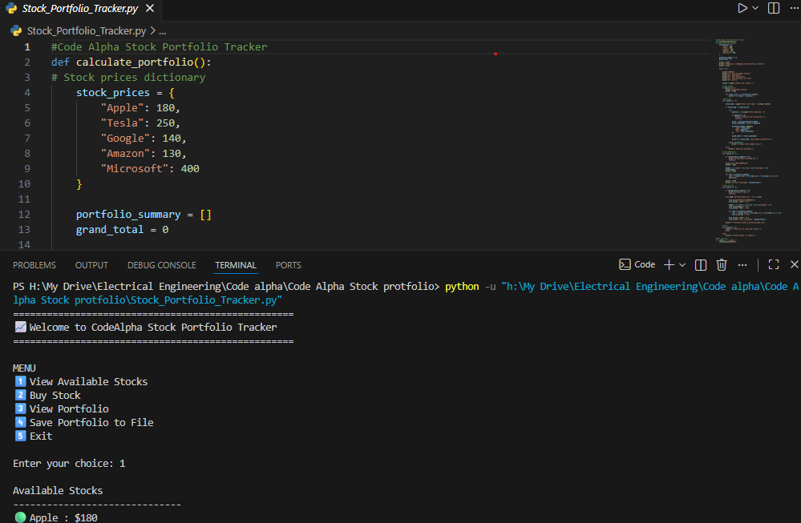

# CodeAlpha_Stock_Portfolio_Tracker
Stock Portfolio Tracker

This is a Python project developed for the CodeAlpha Internship.

Features:
- Track stock investments
- Calculate total investment
- View portfolio summary
- Save portfolio to file

Technologies Used:
- Python
- File Handling
- Dictionaries
- Loops
 [cite: 2026-02-20]

When you run the program, it displays a menu where the user can view available stocks, purchase stocks, view their portfolio, save the portfolio to a file, or exit the program. The user selects a stock and enters the quantity they want to buy. The program then calculates the investment amount and stores it in the portfolio.

After purchasing stocks, the user can view a portfolio summary that shows the stock name, quantity purchased, and the total investment for each stock in a formatted table. The program also calculates and displays the overall total investment. If the user chooses to save the data, the portfolio summary is stored in a text file named portfolio_data.txt.
 [cite: 2026-02-20]

